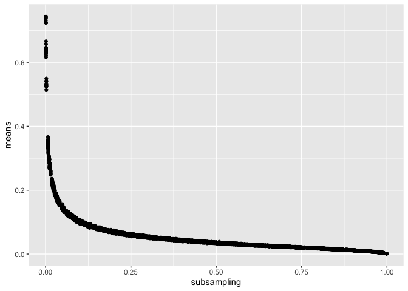
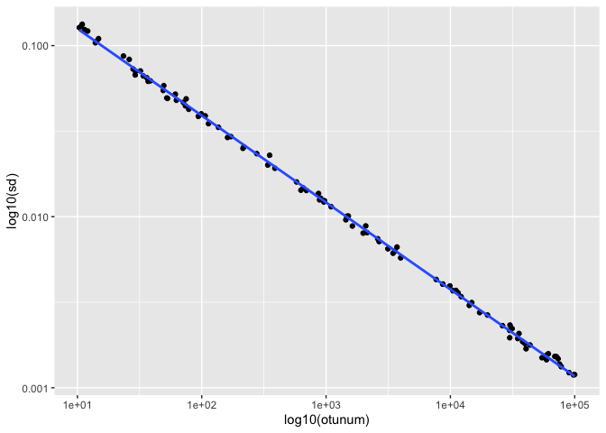
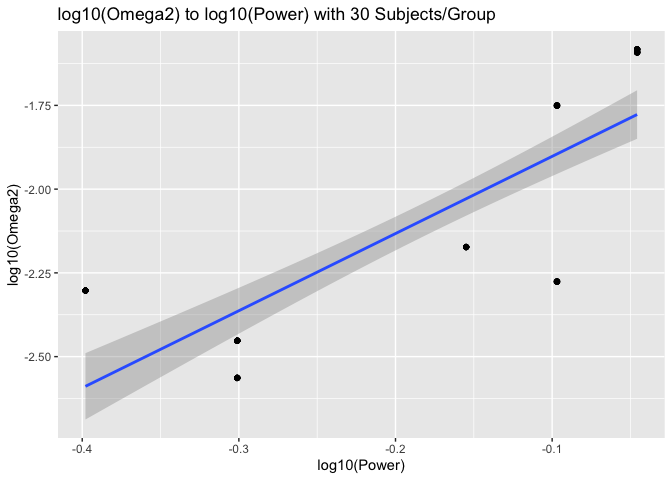

Introduction
============

Power analyses are important for experimental study design so that the
researcher has an idea of how many experiment subjects are needed to
minimize Type II error. Most NIH funding applications require sample
size and power analyses. In microbiome studies power analyses can be
difficult not just because the true effect size is unknown, but also
because the composition of the microbiome in control and experimental
groups (i.e. beta diversity) is generally unknown. However, if the study
intends to use pairwise distances and PERMANOVA to measure diversity
then we can use methods from the R package *micropower* (Kelly et al.
2015) to perform power analyses as long as we have previously available
datasets characteristic of one of the groups (most likely the control)
and some idea of the effect size. The basic idea behind `micropower` is
to simulate distance matrices given prior population parameters computed
from previous studies, then simulate a range of effect sizes,
rarefaction curves, etc. to estimate PERMANOVA power from the simulated
distance matrices.

`micropower` is a great package that I’ve used to perform power analyses
for researchers wanting to do 16s and whole genome shotgun metagenomics
experiments. However it comes without a tutorial or much documentation - there is a [gist available](https://gist.github.com/brendankelly/6673e8596d3cde3fac7d493d7747aa80) though - 
so it’s not entirely clear how to use it. Following is a (more in-depth than the gist) walkthrough of
what such an analysis looks as well as what you will need to
consider for your own power analysis.

Data
----

We will be using data from the Human Microbiome Project for this
tutorial (Methé et al. 2012). The Human Microbiome Project has
alleviated some of the difficulty in a lack of accessible and well
characterized data by providing 16s and whole genome data on 300 healthy
human subjects from the US in multiple tissue types.

In particular we will 1) use the [HMP1 Metadata Project
Catalog](https://www.hmpdacc.org/hmp/catalog/) to find shotgun
metagenomics gut samples, and then 2) match up the SRA IDs of the
samples to the abundances table provided in the shotgun community
profiling database [HMSCP](https://www.hmpdacc.org/hmp/HMSCP/). These
abundances tables are what we will use to compute the necessary
population parameters for the power analysis by transforming them into
OTU tables.

Setting up
==========

This entire analysis can be reproduced by cloning the repository at
<http://github.com/compbiocore/metagenomics-power-analyses-tutorial> and
executing the R notebook (`tutorial.Rmd`) there. If you don’t already
have the packages `micropower`, `devtools` and others installed then
execute the commands below to install the packages.

```r
install.packages('devtools')
devtools::install_github("brendankelly/micropower")
install.packages('knitr')
install.packages('kableExtra')
install.packages('dplyr')
install.packages('ggplot2')
install.packages('parallel')
```

Afterwards we are going to load the packages we need. We will also set a
random seed so as to make the results from this notebook fully
reproducible. Additionally, we have loaded the package **parallel** to
allow us to run operations like `lapply` split up onto multiple cores.
If your machine doesn’t have multiple cores you can omit the package but
everything will take longer so we recommend shortening the number of
simulations to get through the tutorial.

```r
library(micropower)

## Loading required package: permute

library(knitr)
library(kableExtra)
library(dplyr)

## 
## Attaching package: 'dplyr'

## The following object is masked from 'package:kableExtra':
## 
##     group_rows

## The following objects are masked from 'package:stats':
## 
##     filter, lag

## The following objects are masked from 'package:base':
## 
##     intersect, setdiff, setequal, union

library(ggplot2)
library(parallel)
cores = detectCores()
set.seed(515087345)
```

We will assume that you have cloned the entire repository as well and
thus have the same path to the data. If not then modify the variable
`PATH` to point to the path of the data.

```r
PATH='data'
```

Analysis
========

The analysis in general consists of the following steps. First, we
decide on what distance metric we will be using. `micropower`
accommodates both unweighted and weighted Jaccard distances as well as
unweighted or weighted UniFrac distances (Lozupone and Knight 2005). A
discussion of which distance measure to choose is [at the end of this
post](#distance).

Then we find an appropriate dataset, then wrangle the data into an OTU
table. The necessary input for `micropower` is within-group mean and
standard deviations. These can be computed using the chosen distance
metric from OTU tables. Thus any dataset that is used should either
provide within-group mean and standard deviations already, provide a
within-group distance matrix, or provide data that can be transformed
into an OTU table.

After that we do 3 different OTU table simulations to determine
different parameters. In the first, we simulate OTU tables with
different levels of subsampling (rarefaction) in order to find the
subsampling level that corresponds to the within-group mean. In the
second, we simulate OTU tables with different numbers of OTUs and the
given rarefaction level in order to find the number of OTUs
corresponding to the within-group standard deviation. Finally we
simulate OTU tables with different effect sizes and the given
rarefaction level *and* number of OTUs. This finally allows us to answer
questions relating power, sample size, and effect size. For example, we
can find how much power we will have given an effect size and sample
size, or the minimum detectible effect size for a given power level and
sample size, or how many samples we need to achieve at least x power and
be able to detect an effect size of y.

In our hypothetical experiment for this tutorial we are considering 30
samples each in the control and experimental groups with a sequencing
depth of 1000 per OTU bin, as well as performing the PERMANOVA test with
the weighted Jaccard distance. The question we seek to answer is if we
have at least 90% power to detect differences between our control and
experimental groups.

Finding, filtering and transforming the data
--------------------------------------------

To start with, we have provided the project catalog from HMP as
described in [Data](#data). You can download this yourself on their site
by clicking on “HMP metagenomic samples” under *Browse datasets*,
clicking on “View Project Catalog” at the bottom, and then clicking on
the “Save to CSV” button. From here we filter for samples where the
collection site is listed as `gastrointestinal_tract` (gut) and with
gene counts greater than 0 (shotgun metagenomics as opposed to 16s) to
get a list of SRA IDs. This results in 147 samples.

```r
# getting sample IDs
project_catalog<-read.csv(file.path(PATH,"project_catalog.csv"))
kable(head(project_catalog), caption="A few rows of values and column names in project catalog.") %>% kable_styling()
```

<table class="table" style="margin-left: auto; margin-right: auto;">
<caption>
A few rows of values and column names in project catalog.
</caption>
<thead>
<tr>
<th style="text-align:left;">
Sequence.Read.Archive.ID
</th>
<th style="text-align:right;">
NCBI.Project.ID
</th>
<th style="text-align:left;">
HMP.Isolation.Body.Site
</th>
<th style="text-align:left;">
HMP.Isolation.Body.Subsite
</th>
<th style="text-align:right;">
Gene.Count
</th>
<th style="text-align:right;">
IMG.HMP.ID
</th>
<th style="text-align:left;">
Sequencing.Center
</th>
<th style="text-align:left;">
Addition.Date
</th>
<th style="text-align:left;">
Last.Modification.Date
</th>
<th style="text-align:left;">
X
</th>
<th style="text-align:left;">
X.1
</th>
</tr>
</thead>
<tbody>
<tr>
<td style="text-align:left;">
SRS011105
</td>
<td style="text-align:right;">
48479
</td>
<td style="text-align:left;">
airways
</td>
<td style="text-align:left;">
Nares
</td>
<td style="text-align:right;">
4432
</td>
<td style="text-align:right;">
7000000387
</td>
<td style="text-align:left;">
Broad Institute
</td>
<td style="text-align:left;">
2011-04-25T20:00:00
</td>
<td style="text-align:left;">
2011-08-15T20:00:00
</td>
<td style="text-align:left;">
NA
</td>
<td style="text-align:left;">
NA
</td>
</tr>
<tr>
<td style="text-align:left;">
SRS011132
</td>
<td style="text-align:right;">
48479
</td>
<td style="text-align:left;">
airways
</td>
<td style="text-align:left;">
Nares
</td>
<td style="text-align:right;">
316
</td>
<td style="text-align:right;">
7000000030
</td>
<td style="text-align:left;">
Broad Institute
</td>
<td style="text-align:left;">
2011-04-25T20:00:00
</td>
<td style="text-align:left;">
2011-08-15T20:00:00
</td>
<td style="text-align:left;">
NA
</td>
<td style="text-align:left;">
NA
</td>
</tr>
<tr>
<td style="text-align:left;">
SRS011263
</td>
<td style="text-align:right;">
48479
</td>
<td style="text-align:left;">
airways
</td>
<td style="text-align:left;">
Nares
</td>
<td style="text-align:right;">
108
</td>
<td style="text-align:right;">
7000000542
</td>
<td style="text-align:left;">
Broad Institute
</td>
<td style="text-align:left;">
2011-04-25T20:00:00
</td>
<td style="text-align:left;">
2011-08-15T20:00:00
</td>
<td style="text-align:left;">
NA
</td>
<td style="text-align:left;">
NA
</td>
</tr>
<tr>
<td style="text-align:left;">
SRS011397
</td>
<td style="text-align:right;">
48479
</td>
<td style="text-align:left;">
airways
</td>
<td style="text-align:left;">
Nares
</td>
<td style="text-align:right;">
8467
</td>
<td style="text-align:right;">
7000000209
</td>
<td style="text-align:left;">
Broad Institute
</td>
<td style="text-align:left;">
2011-04-25T20:00:00
</td>
<td style="text-align:left;">
2011-08-15T20:00:00
</td>
<td style="text-align:left;">
NA
</td>
<td style="text-align:left;">
NA
</td>
</tr>
<tr>
<td style="text-align:left;">
SRS012291
</td>
<td style="text-align:right;">
48479
</td>
<td style="text-align:left;">
airways
</td>
<td style="text-align:left;">
Nares
</td>
<td style="text-align:right;">
37
</td>
<td style="text-align:right;">
7000000717
</td>
<td style="text-align:left;">
Broad Institute
</td>
<td style="text-align:left;">
2011-04-25T20:00:00
</td>
<td style="text-align:left;">
2011-08-15T20:00:00
</td>
<td style="text-align:left;">
NA
</td>
<td style="text-align:left;">
NA
</td>
</tr>
<tr>
<td style="text-align:left;">
SRS012663
</td>
<td style="text-align:right;">
48479
</td>
<td style="text-align:left;">
airways
</td>
<td style="text-align:left;">
Nares
</td>
<td style="text-align:right;">
4460
</td>
<td style="text-align:right;">
7000000424
</td>
<td style="text-align:left;">
Broad Institute
</td>
<td style="text-align:left;">
2011-04-25T20:00:00
</td>
<td style="text-align:left;">
2011-08-15T20:00:00
</td>
<td style="text-align:left;">
NA
</td>
<td style="text-align:left;">
NA
</td>
</tr>
</tbody>
</table>

```r
IDs <- select(project_catalog, Sequence.Read.Archive.ID, HMP.Isolation.Body.Site, Gene.Count) %>%
      filter(HMP.Isolation.Body.Site=='gastrointestinal_tract' & Gene.Count>0) %>%
      .$Sequence.Read.Archive.ID
length(IDs)

## [1] 147
```

With the list of SRA IDs we can then download abundance tables
associated with those SRA IDs. Here we have provided them in the Github
repo for you, but if you want to download your own data, the HMP project
provides a client
[Aspera](https://www.hmpdacc.org/hmp/resources/download.php) to do so.

The abundance tables from HMP need to be set up so that columns are by
sample (SRA IDs), rows are by reference name, and entries are by the
number of reads per sample per reference name i.e. like an OTU table. In
addition, the information provided in each sample’s abundance table is
depth, breadth, and total reference bases. Depth is the number of times
the reference was covered, breadth is the proportion of reference bases
that were covered, and total reference bases is the length of the
genome. In addition, the length of reads in sequencing was 100, and the
breadth is given as a number out of 100. To get the number of reads
covering a reference then we take the depth x total reference bases x
breadth / (100 x 100). We then join the 147 samples together as columns.

```r
tsvs<-lapply(IDs, function(x) read.csv(file.path(PATH,paste0(x,'.tsv')),sep='\t') %>% transmute(Reference.Name=Reference.Name,Nreads=Depth*Breadth*Total.reference.bases/10000))
otu_table<-Reduce(function(...) full_join(...,by="Reference.Name"), tsvs)

colnames(otu_table) <- c("Reference.Name",as.character(IDs))
otu_table[is.na(otu_table)] <- 0 # convert NAs to 0
```

Compute within-group mean and standard deviation from distance matrix
---------------------------------------------------------------------

Now that we have an OTU table we can compute the pairwise unweighted
Jaccard distances. Then we just take the mean and standard deviation of
the matrix to get the necessary population parameters.

```r
jaccard<-calcWJstudy(otu_table[,2:148])
m<-mean(jaccard) #0.7676824
s<-sd(jaccard) #0.1317751
```

Determine rarefaction and number of OTUs
----------------------------------------

Once we have determined population parameters for within-group
distances, we now use `hashMean` to simulate a list of OTU tables at
different levels of subsampling (`rare_levels`) so that we can determine
what level of subsampling produces OTU tables with the same mean
pairwise distance 0.7676824.

```r
#weight_hm<-hashMean(rare_levels=runif(1000,0,1),rep_per_level=10,otu_number=1000,sequence_depth=1000)
#means<-mclapply(weight_hm, function(x) (mean(lowerTriDM(calcWJstudy(x)))),mc.cores=cores)
#names(means) <- sapply(strsplit(names(means),"_"),FUN=function(x) {x[[1]]})
#save(means,file="means.Rdata")
load("means.Rdata")
mean_df <- data.frame(subsampling=as.numeric(names(means)),means=as.numeric(means),target=abs(as.numeric(means)-m))
subsample <- mean_df[which(mean_df$target==min(mean_df$target)),]$subsampling
qplot(data=mean_df,x=subsampling,y=means)
```



In more detail:

-   `hashMean` simulates a list of OTU tables with different levels of
    subsampling (`rare_levels`). We draw 1000 samples uniformly from
    `[0,1]` here. `rep_per_level` indicates the number of replicates per
    subsampling level. Thus we have 1000 x 10 = 10000 simulated OTU
    tables. `otu_number` indicates the number of simulated OTUs, and
    `sequence_depth` indicates the average number of sequence counts per
    OTU bin. The names of the list are the levels of subsampling with
    the index number
-   We use `mclapply` to parallelize computing Jaccard distances of the
    OTU tables with `calcWJstudy` and then the means of those distances
-   To save time, we loaded the means from an Rdata object.
-   `mean_df` is a dataframe with three columns: subsampling level
    (taken from `names(means)`), within-group mean of the Jaccard
    distance for the OTU table generated at that subsampling level, and
    the absolute difference between the simulated within-group means and
    the true within-group mean
-   From here we take the subsampling level that corresponds to the
    minimum absolute difference between simulated mean and true
    within-group mean. In theory we could fit it with an exponential
    decay or loess regression (you can do so yourself with
    `fit <- nls(means ~ SSasymp(subsampling, yf, y0, log_alpha), data = mean_df)`)
    but the fit is not the best. Since we are just trying to get an
    estimate this works as well.
-   `qplot` provides a plot of how within-group mean drops as
    subsampling level increases.

Once we have the level of subsampling ($subsample=$7.729136910^{-4}), we
use `hashSD` to simulate a list of OTU tables at different numbers of
OTUs at our specific subsampling level to determine what number of OTUs
produces OTU tables with the same standard deviation of pairwise
distance. These are the additional parameters that will be used to
simulate OTU tables under a range of effect sizes. More on the theory
behind this and the validation is available in the paper.

```r
#weight_hsd<-hashSD(rare_depth=subsample,otu_number_range=10^runif(n = 100,min = 1,max = 5),sim_number=30, sequence_depth=1000)
#sds<-mclapply(weight_hsd, function(x) (sd(lowerTriDM(calcWJstudy(x)))), mc.cores=cores) 
#names(sds) <- sapply(names(sds), function(x) substring(x,4))
#save(sds,file="sds.Rdata")
load("sds.Rdata")
sds_df <- data.frame(otunum=as.numeric(names(sds)),sd=as.numeric(sds),target=abs(as.numeric(sds)-s))
otunum <- sds_df[which(sds_df$target==min(sds_df$target)),]$otunum
qplot(data=sds_df,x=otunum,y=sd) + geom_smooth(method="lm") + scale_x_log10() + scale_y_log10() + xlab("log10(otunum)") + ylab("log10(sd)")
```

*Scatter plot for means vs subsampling with weighted Jaccard distance from hashMeans*

In more detail:

-   `hashSD` simulates a list of OTU tables with different numbers of
    OTUs sampled. `rare_depth` is the subsampling level, and should be
    set to the subsampling level predicted from earlier.
    `otu_number_range` is the range of OTU numbers to test. `sim_number`
    is the number of simulated subjects per OTU number, and should
    correspond to the expected number of subjects in your study.
    `sequence_depth` is the same as in `hashMean`, and should remain the
    same.
-   The Jaccard distance computation can take a long time, so to save
    time `sds` has already been saved and loaded.
-   Similarly to above, we compute the standard deviation for each OTU
    table from `hashSD` and then pick the otu number that corresponds
    most closely to the known standard deviation.
-   The plot here is done on a log scale and fitted with a linear model,
    which models the relationship between standard deviation and OTU
    number well. We could have done `lm` and `predict` if we had wanted
    to instead.

Simulate OTUs under different effect sizes
------------------------------------------

Finally, the OTU number and the rarefaction level get passed to
`simPower` along with the number of subjects in each group and a range
of effect sizes in order to simulate a list of OTU tables. We then
compute the weighted Jaccard distance for the list of OTUs one more
time. We can check here that the means and standard deviations for these
OTU tables correspond approximately to the mean and standard deviation
we had for our control group.

```r
sp<-simPower(group_size_vector=c(30,30), otu_number=otunum, rare_depth=subsample,sequence_depth=1000,effect_range=seq(0,0.3,length.out=100))
wj<-mclapply(sp,function(x) calcWJstudy(x),mc.cores=cores)
# check if mean & sd is approximately OK
mean(as.numeric(mclapply(wj, mean, mc.cores=4)))

## [1] 0.7271514

mean(as.numeric(mclapply(wj, sd, mc.cores=4)))

## [1] 0.1690322
```

Compute and predict PERMANOVA power
-----------------------------------

We can now compute PERMANOVA power with bootstrapping for each distance
matrix given the number of subjects in each group to sample and type I
error. Finally we can convert our list of PERMANOVA powers into a
dataframe with a column for (log) effect size and a column for (log)
power, fit a linear model, and use it to predict what the smallest
detectable effect size we’ll have for a given power level. We can also
plot the relationship between effect size and power with x
subjects/group.

```r
bp30<-bootPower(wj, boot_number=10, subject_group_vector=c(30,30),alpha=0.05)
bp30_model <- subset(bp30, power < 0.95 & power > 0.2)
bp30_model <- data.frame(log_omega2=log10(bp30_model$simulated_omega2),log_power=log10(bp30_model$power))
bp30_model <- subset(bp30_model, log_omega2>-Inf)
bp30_lm <- lm(log_omega2 ~ log_power, data=bp30_model)
power80 <- 10^predict(bp30_lm, newdata=data.frame(log_power=log10(0.8)))
power90 <- 10^predict(bp30_lm, newdata=data.frame(log_power = log10(0.9)))
ggplot2::qplot(data=bp30_model,x=log_power,y=log_omega2) + geom_smooth(method="lm") + ggtitle("log10(Omega2) to log10(Power) with 30 Subjects/Group") + xlab("log10(Power)") + ylab("log10(Omega2)")
```



It turns out we have 80% power to detect an effect size of 0.0127314,
and 90% power to detect an effect size of 0.0167005. Is this good
enough? Well it falls within the lower end of the range of catalogued
effect sizes from the `micropower` paper (Kelly et al. 2015), so
probably. But of course it depends on what you’re actually looking to
study. See [How do I know the effect size for my study?](#effect) That
is however, all the steps that are needed in `micropower` to actually
perform a power analysis for a microbiome study using PERMANOVA.

Additional considerations
=========================

How do I know the effect size for my study?
-------------------------------------------

Well that’s always the difficulty of power analyses, isn’t it? Luckily
in the `micropower` paper there is a table cataloguing effect sizes with
different distance measures and different comparisons that can be used
as a point of reference. If the minimum effect size able to be detected
at a *x* power falls within the range of catalogued effect sizes then it
is a good bet that your study has enough power with the proposed number
of subjects. With a pilot study or a prior study that can be used as a
proxy, as long as you have OTU tables or distance matrices, you can use
the `calcOmega2` function from `micropower` to estimate the effect size
as well.

What distance measure should I use?
-----------------------------------

`micropower` allows for two distance measures: Jaccard and UniFrac; and
in two different ways: unweighted or weighted. Jaccard and UniFrac
distances are also the most commonly used in microbiome studies. UniFrac
is a phylogenetic based distance metric that accounts for the fraction
of branch length in a phylogenetic tree between two sets of taxa, while
Jaccard distance is a non-phylogenetic distance metric between two sets.
In general if a phylogenetic tree is available then UniFrac is a better
choice. The choice between unweighted and weighted comes down to what
you’re trying to measure in your study. Unweighted measures consider
only the presence or absence of taxa, while weighted take into account
relative abundance as well.

Why micropower? What about other packages?
------------------------------------------

I like `micropower` specifically because (1) it deals with the PERMANOVA
test, which is commonly used in microbiome studies, and (2) you only
need abundance tables for one group, which usually means you can just
use control data from HMP. I also like the `HMP` package (Rosa et al.
2012), but in order to do power-sample size calculations you need to
have abundance tables for all groups. It is also meant for power
analyses with the Dirichlet-multinomial mixture model.

References
==========

Kelly, Brendan J., Robert Gross, Kyle Bittinger, Scott Sherrill-Mix,
James D. Lewis, Ronald G. Collman, Frederic D. Bushman, and Hongzhe Li.
2015. “Power and sample-size estimation for microbiome studies using
pairwise distances and PERMANOVA.” *Bioinformatics*.
<https://doi.org/10.1093/bioinformatics/btv183>.

Lozupone, Catherine, and Rob Knight. 2005. “UniFrac: A new phylogenetic
method for comparing microbial communities.” *Applied and Environmental
Microbiology*. <https://doi.org/10.1128/AEM.71.12.8228-8235.2005>.

Methé, Barbara A., Karen E. Nelson, Mihai Pop, Heather H. Creasy,
Michelle G. Giglio, Curtis Huttenhower, Dirk Gevers, et al. 2012. “A
framework for human microbiome research.” *Nature*.
<https://doi.org/10.1038/nature11209>.

Rosa, Patricio S. la, J. Paul Brooks, Elena Deych, Edward L. Boone,
David J. Edwards, Qin Wang, Erica Sodergren, George Weinstock, and
William D. Shannon. 2012. “Hypothesis Testing and Power Calculations for
Taxonomic-Based Human Microbiome Data.” *PLoS ONE*.
<https://doi.org/10.1371/journal.pone.0052078>.
